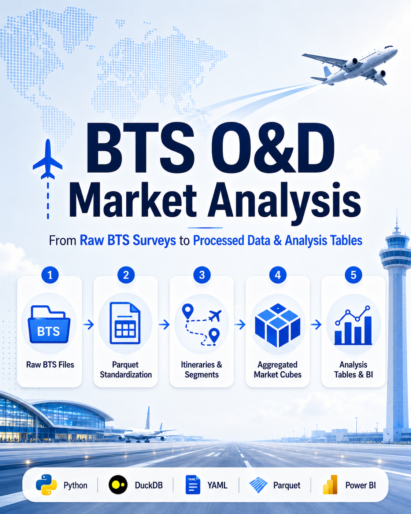

# BTS O&D Market Analysis

<p align="center">
  
</p>

## From Raw BTS Surveys to Processed Data & Analysis Tables

This repository presents an aviation data analytics project that transforms raw BTS Origin & Destination survey files into structured, processed and analysis-ready tables for U.S. air travel market analysis.

The project is designed around a layered workflow: raw survey files are standardized, modeled into itineraries and segments, aggregated into reusable market cubes, and finally converted into compact tables that can support route opportunity screening, connectivity diagnostics, competitive analysis and dashboarding.

---

## Why this project matters

BTS O&D survey data is valuable, but it is not immediately convenient for business analysis. The files are large, period-based, wide, and contain itinerary-level structures that need to be normalized before they can be used effectively.

This project shows how that raw survey data can be converted into a practical analytical model for aviation market work.

```text
Raw BTS survey files
        ↓
Standardized Parquet files
        ↓
Itineraries and segments
        ↓
Aggregated market cubes
        ↓
Processed analysis tables
        ↓
Dashboard-ready market outputs
```

---

## Pipeline architecture

| Layer | Main output | Purpose |
|---|---|---|
| Raw source | BTS DB1C / DB1B files | Original O&D survey files by reporting period. |
| Program 1 | Standardized Parquet files | Ingestion, extraction, archiving, period detection and schema standardization. |
| Program 2 | Itineraries and segments | Analytical modeling at trip level and segment/coupon level. |
| Program 3 | Aggregated market cubes | YAML-driven grouped tables by market, airport, carrier, itinerary type, booking window and region. |
| Program 4 | Analysis-ready tables | Final processed tables prepared for market analysis and visualization. |

See the full explanation in [docs/architecture.md](docs/architecture.md) and [docs/workflow.md](docs/workflow.md).

---

## Final analysis tables

The final layer produces a compact set of tables designed for direct analytical use.

| Table | Description |
|---|---|
| `market_core_summary` | Core market view for passengers, revenue, fares, yield and trend diagnostics. |
| `market_competition_summary` | Carrier leadership, market share, HHI, concentration and competitive risk. |
| `market_connectivity_summary` | Nonstop share, connection share, segment mix and travel friction. |
| `market_booking_summary` | Purchase-window mix, booking behavior and fare by booking timing. |
| `market_airport_summary` | Airport-pair drill-down for route-level traffic and fare analysis. |
| `market_wac_summary` | Regional traffic flows and macro geographic market view. |
| `market_seasonality_summary` | Seasonal demand patterns, peak quarter and quarterly variation. |
| `market_opportunity_summary` | Strategic opportunity scoring and market prioritization. |
| `dim_period` | Time dimension for filtering, period alignment and reporting structure. |

More detail is available in [docs/analytics_tables_guide.md](docs/analytics_tables_guide.md).

---

## Programs overview

### Program 1 — Raw BTS ingestion and standardization

Processes raw BTS files, archives originals, extracts compressed sources, detects reporting periods, converts source tables into Parquet and standardizes the output schema.

### Program 2 — Itineraries and segments builder

Creates two analytical views: one row per complete O&D itinerary and one row per flight segment/coupon. This separates market demand from network routing.

### Program 3 — Aggregation engine

Builds reusable market cubes from the itinerary and segment layers. Aggregations and metrics are configured externally using YAML.

### Program 4 — Analytics builder

Combines aggregated cubes into final processed tables for market analysis, including competition, connectivity, booking, seasonality and opportunity scoring.

See [docs/programs_overview.md](docs/programs_overview.md) for screenshots and a program-by-program explanation.

---

## Example transformation

The repository includes small sample files that illustrate the transformation logic without requiring the full BTS dataset.

| Stage | Example file | What it shows |
|---|---|---|
| Raw-style input | `examples/raw_survey_sample.csv` | Simplified source-style fields before modeling. |
| Itineraries | `examples/itineraries_sample.csv` | One row per complete O&D journey. |
| Segments | `examples/segments_sample.csv` | One row per segment inside an itinerary. |
| Core market table | `examples/market_core_summary_sample.csv` | Market-period metrics such as passengers, fare and connection share. |
| Opportunity table | `examples/market_opportunity_summary_sample.csv` | Final strategic scoring layer for route opportunity screening. |

---

## Technologies used

- **Python** for data processing and pipeline orchestration.
- **DuckDB** for SQL transformations over Parquet files.
- **Parquet** for efficient analytical storage.
- **YAML** for configurable aggregation and analysis definitions.
- **Power BI** for final visualization and business exploration.

---

## Intended analysis use cases

- O&D market ranking by passengers, revenue, fare or yield.
- Nonstop versus connecting market diagnostics.
- Carrier leadership and competitive concentration.
- Airport-pair drill-down within multi-airport city markets.
- Purchase-window and booking behavior analysis.
- Seasonal demand pattern detection.
- Direct route opportunity screening.
- Strategic market prioritization.

---

## Documentation

- [Architecture](docs/architecture.md)
- [Workflow](docs/workflow.md)
- [Programs overview](docs/programs_overview.md)
- [Analytics tables guide](docs/analytics_tables_guide.md)

---

## Data note

The examples included here are simplified samples intended to explain the workflow and table design. Full BTS source files and large generated Parquet outputs are not included in this repository.
