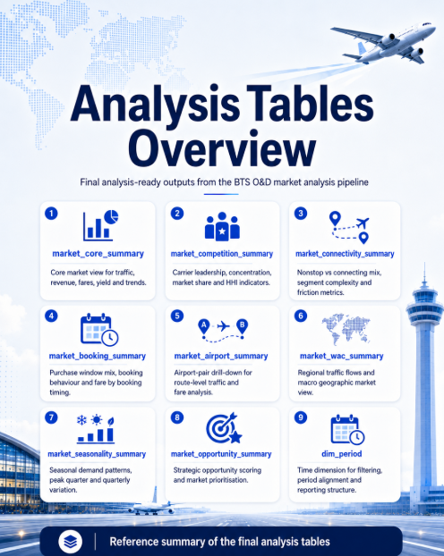

# Analytics tables guide

This guide summarizes the final processed tables produced by the analytics layer. These are the main tables intended for exploration, visualization and business interpretation.

<p align="center">
  
</p>

---

## Quick table map

| Table | Grain | Main use |
|---|---|---|
| `market_core_summary` | O&D market + period | Market size, revenue, pricing, yield and trend diagnostics. |
| `market_competition_summary` | O&D market + period | Carrier leadership, market share, HHI and competitive risk. |
| `market_connectivity_summary` | O&D market + period | Nonstop versus connecting, segment friction and route quality. |
| `market_booking_summary` | O&D market + period | Purchase-window mix and booking behavior. |
| `market_airport_summary` | Airport pair + period | Airport-to-airport drill-down. |
| `market_wac_summary` | WAC pair + period | Macro-regional traffic flows. |
| `market_seasonality_summary` | O&D market + quarter | Seasonality pattern and peak quarter. |
| `market_opportunity_summary` | O&D market + period | Strategic ranking table combining market, competition, connectivity and scoring features. |
| `dim_period` | Period | Date/period dimension for filtering and sorting. |

---

## 1. market_core_summary

### What it is

Core O&D market table. It should be the first table used to understand the size, value and trend of each market.

### Main uses

- Market overview.
- Top O&D rankings by passengers, revenue, fare or yield.
- Historical trend by period.
- Pricing and yield diagnostics.
- Baseline table for opportunity scoring.

### Important columns

```text
period_type
report_year
report_month
report_quarter
report_period
period_start
origin_city_market
destination_city_market
od_city_market
passengers
total_amount
avg_fare
yield_gross
nonstop_pct
connection_pct
weighted_avg_num_segments
```

### Useful visuals

- Passenger trend by period.
- Top O&D markets by passengers or revenue.
- Scatter plot: passengers versus average fare.
- Market matrix: origin city market versus destination city market.

---

## 2. market_competition_summary

### What it is

Competitive summary at market-period level. It summarizes carrier leadership and concentration from carrier-level cubes.

### Main uses

- Identify leading carriers in each market.
- Detect monopolies, duopolies and fragmented markets.
- Compare marketing carrier and operating carrier leadership.
- Estimate competitive risk.

### Important columns

```text
leader_marketing_carrier
leader_marketing_share
num_marketing_carriers
marketing_hhi
top3_marketing_share
leader_operating_carrier
leader_operating_share
operating_hhi
```

### Useful visuals

- Bar chart: leader carrier share by market.
- Scatter plot: passengers versus HHI.
- Table: market, leader, leader share, number of carriers and HHI.
- Trend line: concentration over time.

---

## 3. market_connectivity_summary

### What it is

Connectivity and itinerary quality table. It combines itinerary type, number of segments and core market connectivity fields.

### Main uses

- Measure whether a market is mostly nonstop or connecting.
- Detect markets with high travel friction.
- Support direct route opportunity analysis.
- Understand product quality and passenger inconvenience.

### Important columns

```text
nonstop_share
one_stop_share
two_stop_share
three_plus_share
share_1_segment
share_2_segments
share_3plus_segments
connection_pct
connecting_share
weighted_avg_num_segments
friction_score_raw
```

### Useful visuals

- Stacked bar: nonstop, one-stop, two-stop and three-plus mix.
- Scatter plot: passengers versus connection share.
- Ranking: highest friction markets.
- Trend chart: connecting share by period for selected markets.

---

## 4. market_booking_summary

### What it is

Booking behavior table generated from purchase-window groups.

### Main uses

- Estimate business-like versus leisure-like demand patterns.
- Understand late booking and advance purchase behavior.
- Support pricing and revenue management analysis.
- Detect shifts in purchase behavior over time.

### Important columns

```text
purchase_window_*_share
purchase_window_*_avg_fare
purchase_window_known_share
```

### Useful visuals

- Stacked bar: purchase-window mix by market or period.
- Line chart: late booking share over time.
- Column chart: average fare by purchase window.
- Scatter plot: late booking share versus average fare.

---

## 5. market_airport_summary

### What it is

Airport-pair drill-down table. It is more operational than city-market level because it shows specific airport-to-airport flows.

### Main uses

- Analyze airport pairs inside multi-airport markets.
- Compare alternative airport routes.
- Understand which airport pair matters after identifying a city market.
- Compare airport-pair fare with city-market average fare.

### Important columns

```text
origin_airport
destination_airport
od_airport_market
od_airport_market_bidirectional
passengers
total_amount
avg_fare
airport_pair_avg_fare_calc
```

### Useful visuals

- Top airport pairs by passengers.
- Origin airport versus destination airport matrix.
- Airport-pair trend over time.
- Airport-pair fare comparison.

---

## 6. market_wac_summary

### What it is

Macro-geographic table based on WAC flows. It is useful when city or airport level is too granular.

### Main uses

- Regional market overview.
- Macro traffic-flow diagnostics.
- Executive-level geographic summaries.
- Broad regional demand pattern detection.

### Important columns

```text
origin_wac
destination_wac
od_wac_market
od_wac_market_bidirectional
passengers
total_amount
avg_fare
```

### Useful visuals

- Top WAC flows.
- Regional passenger trend.
- Regional passengers versus fare scatter.
- Origin WAC versus destination WAC matrix.

---

## 7. market_seasonality_summary

### What it is

Quarterly seasonality table. It summarizes how each market behaves by quarter of the year.

### Main uses

- Identify seasonal markets.
- Detect peak quarters.
- Compare stable and seasonal demand profiles.
- Support capacity planning and seasonal route evaluation.

### Important columns

```text
od_city_market
report_quarter
avg_quarter_passengers
avg_seasonality_index
observations
peak_quarter
```

### Useful visuals

- Seasonality index by quarter.
- Peak quarter distribution.
- Market versus quarter heatmap.
- Market size versus seasonality volatility.

---

## 8. market_opportunity_summary

### What it is

Strategic table that combines core market, competition, connectivity, booking and seasonality features. It is the best starting point for route opportunity screening.

### Main uses

- Rank direct route opportunities.
- Find high-value markets.
- Identify underserved markets.
- Compare opportunity and competitive risk.
- Create executive market prioritization views.

### Important columns

```text
passengers
total_amount
avg_fare
yield_gross
passengers_yoy_growth
connection_pct
connecting_share
friction_score_raw
leader_marketing_carrier
leader_marketing_share
marketing_hhi
direct_route_opportunity_score
premium_market_score
business_market_score
competitive_risk_score
```

### Useful visuals

- Top route opportunity ranking.
- Opportunity score versus competitive risk scatter.
- Passengers versus connection share scatter.
- Premium-market ranking.
- Selected-market profile table.

---

## 9. dim_period

### What it is

Period dimension table used for filtering, sorting and clean time analysis.

### Important columns

```text
period_type
report_year
report_month
report_quarter
report_period
period_start
```

### Main uses

- Year and period filters.
- Correct sorting of months and quarters.
- Separation of monthly and quarterly views.
