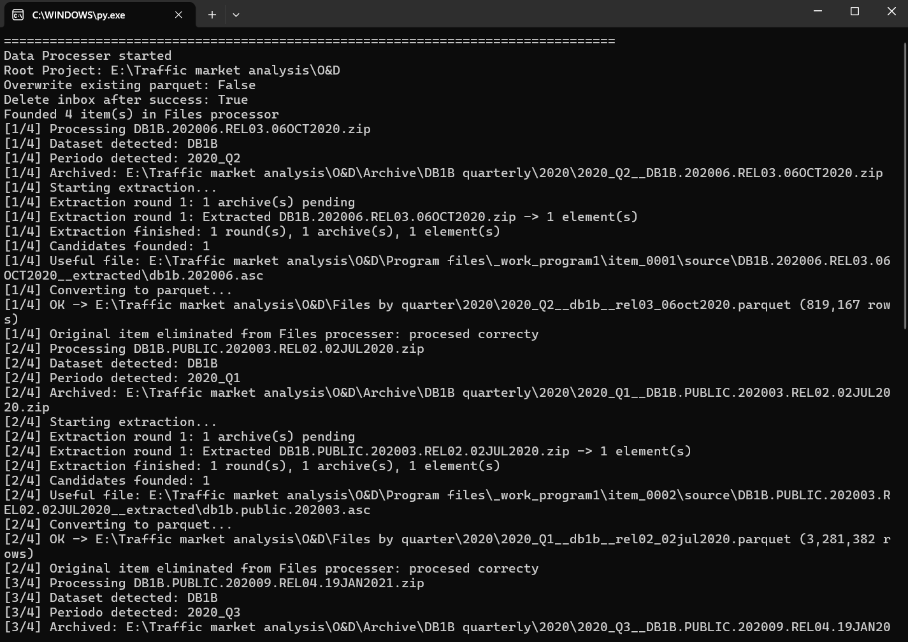
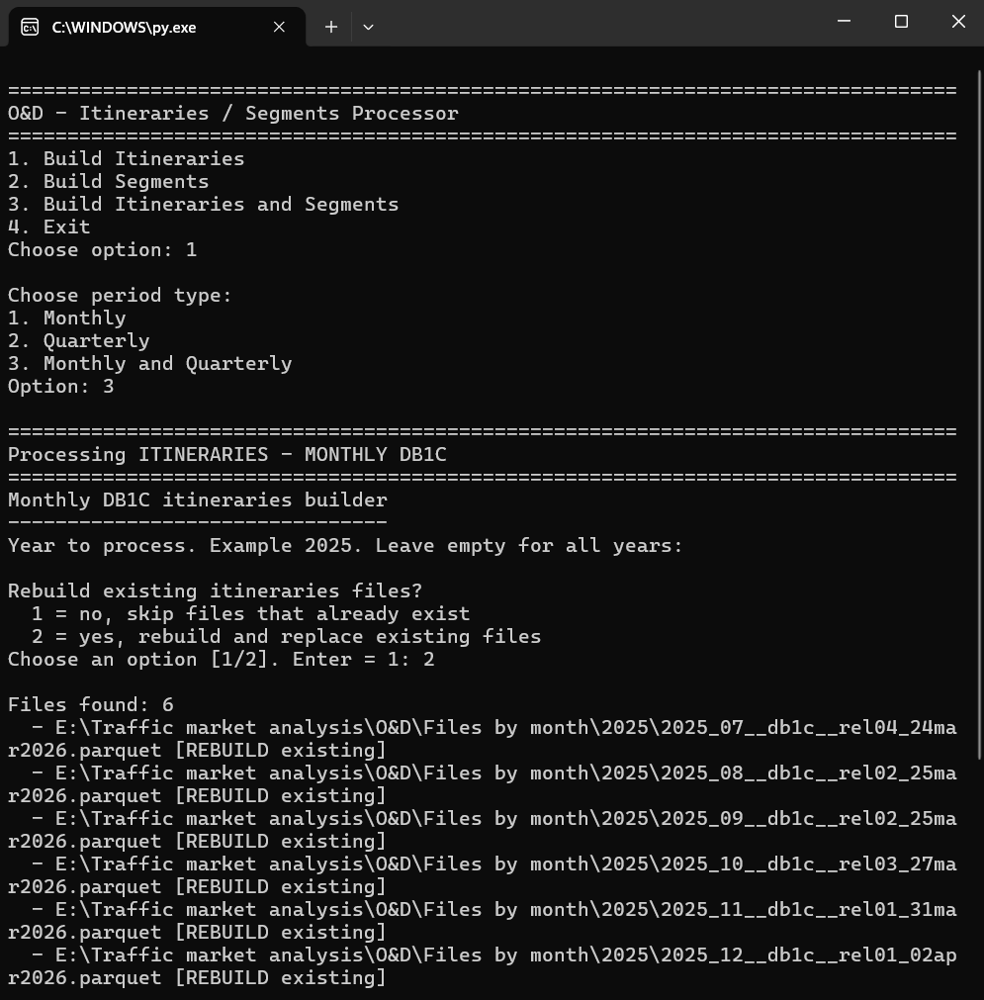
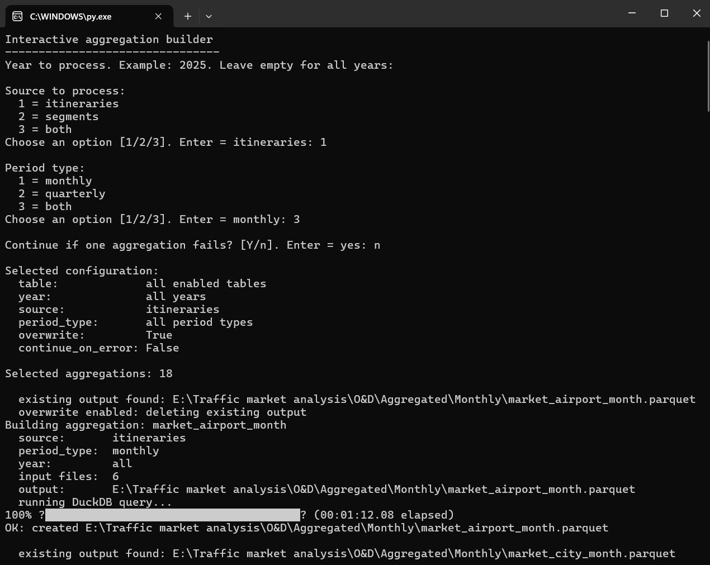
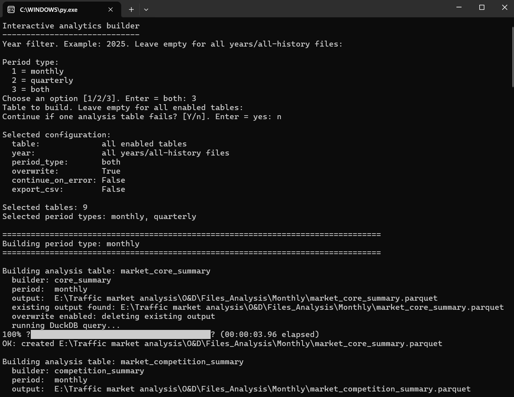

# Programs overview

The project is organized around four processing programs. The repository presents them as a documented data pipeline supported by screenshots and sample outputs.

---

## Program 1 — Raw BTS ingestion and standardization

### Purpose

Transform raw BTS survey files into standardized Parquet files.

### Input

```text
Files processer/
```

Typical inputs include compressed BTS files, text files or raw tabular downloads.

### Main actions

- Detect dataset type and reporting period.
- Archive the original input file.
- Extract compressed files.
- Select the useful tabular source file.
- Convert the data to Parquet.
- Add metadata.
- Standardize schemas.
- Write logs and manifests.

### Output

```text
Files by month/
Files by quarter/
Archive/
Logs/
```

### Why it matters

This creates an auditable, reusable storage layer for the rest of the project.

<p align="center">
  
</p>

## Program 2 — Itineraries and segments builder

### Purpose

Convert standardized Parquet files into two analytical models: full itineraries and individual segments.

### Itineraries

One row represents one complete O&D journey.

Useful columns:

```text
report_period
origin_airport
destination_airport
od_airport_market
origin_city_market
destination_city_market
od_city_market
passengers
total_amount
num_segments
itinerary_type
```

### Segments

One row represents one segment/coupon within an itinerary.

Useful columns:

```text
itinerary_id
segment_number
segment_origin_airport
segment_destination_airport
segment_marketing_carrier
segment_operating_carrier
segment_distance
```

### Output

```text
Files_Itineraries/
Files_Segments/
```

### Why it matters

It separates market demand from network routing. This makes it possible to analyze both what passengers bought and how they physically traveled.

<p align="center">
  
</p>

## Program 3 — YAML-driven aggregation engine

### Purpose

Create reusable market cubes from the itineraries and segments datasets.

### Input

```text
Files_Itineraries/
Files_Segments/
YAML configuration files
```

### Main actions

- Read aggregation definitions from YAML.
- Read reusable metric formulas from YAML.
- Find input Parquet files by source and period type.
- Group the data by selected dimensions.
- Calculate metrics such as passengers, revenue, average fare, connection share and yield.
- Apply post-aggregation metrics such as shares, growth and ranking.

### Output

```text
Aggregated/Monthly/
Aggregated/Quarterly/
```

### Why it matters

This layer turns modeled row-level data into reusable analytical cubes.

<p align="center">
  
</p>

## Program 4 — Analytics builder

### Purpose

Transform aggregated cubes into final processed analysis tables.

### Input

```text
Aggregated/Monthly/
Aggregated/Quarterly/
```

### Main actions

- Read market, carrier, airport, itinerary type, purchase window and WAC cubes.
- Harmonize monthly and quarterly period fields.
- Build final summary tables.
- Calculate competition and connectivity features.
- Build opportunity scores.
- Write Parquet outputs and manifests.

### Output

```text
Files_Analysis/Monthly/
Files_Analysis/Quarterly/
```

### Why it matters

This is the final processed layer. It reduces the number of tables needed for analysis and creates a clean structure for strategic market work.

<p align="center">
  
</p>

